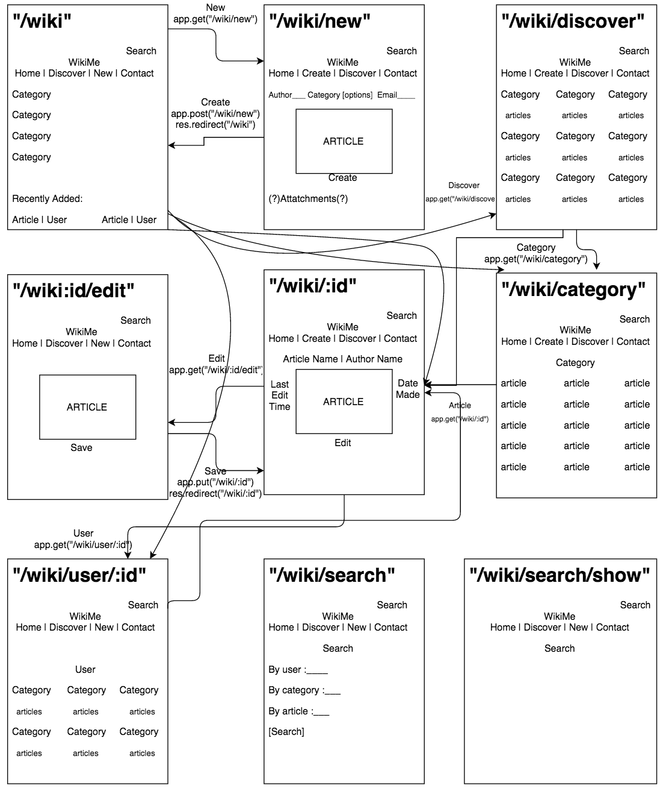
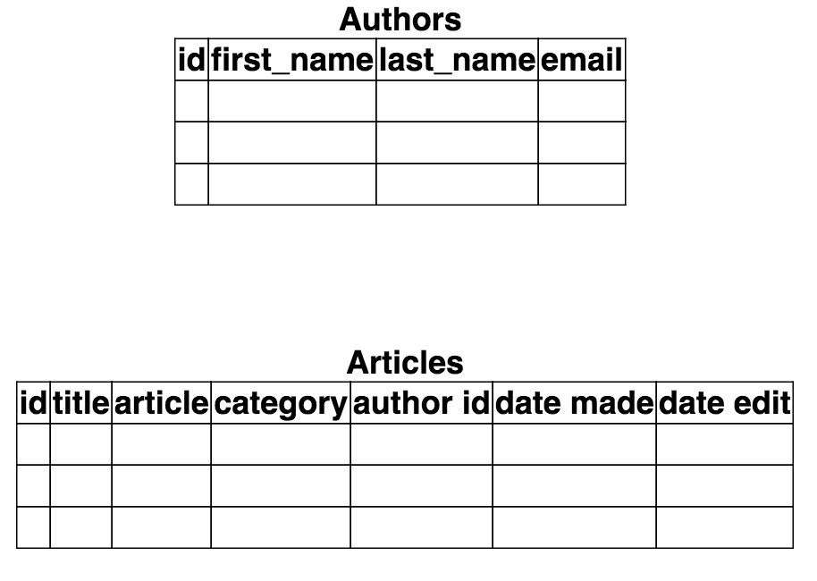

#Wiki Sports
##Project 2

For this project I decided to create a wiki website about sports.
Articles can be added and stored into categories.
Each article has the ability to be edited and saved.

###User Story
A user can create a new article and save it to a category

Any user can then access the article through various methods including: search bar, recently added, categories

A user can edit the posted article and save the edited version

###Wireframes & Routes

###Database Grid

###Psuedo
- declare express and many other npm modules
- create a database and schema
- create two tables, articles and authors
- follow the database grid
- using express get a route for each wireframe mapped out above
- create a nav bar to easily go through routes
- connect each wireframe through routes mapped out above
- for each route and wireframe, get, run and all from the db the data for the page
- use inner join for most db.get/db.run to get all information necessary
- complete style through linking to pure

###Languages and others
- Javascript
- HTML
- CSS
- Express
- EJS
- Pure
- Trello
- Draw.io
